# InventarioPlus - Use Case Diagram

```mermaid
graph TB
    %% Actors
    Admin[👤 Administrator]
    Operator[👤 Operator]
    Viewer[👤 Viewer]
    Specialist[👤 Specialist]
    Client[👤 Client]

    %% Authentication & Authorization
    subgraph "Authentication & Authorization"
        UC001[Login to System]
        UC002[Logout from System]
        UC003[Manage User Roles]
        UC004[Change Password]
    end

    %% User Management
    subgraph "User Management"
        UC005[Create User]
        UC006[View Users]
        UC007[Edit User]
        UC008[Delete User]
        UC009[Activate/Deactivate User]
        UC010[Manage User Roles]
    end

    %% Client Management
    subgraph "Client Management"
        UC011[Register Client]
        UC012[View Clients]
        UC013[Edit Client Information]
        UC014[Delete Client]
        UC015[Search Clients]
        UC016[View Client History]
    end

    %% Equipment Management
    subgraph "Equipment Management"
        UC017[Add Equipment]
        UC018[View Equipment Catalog]
        UC019[Edit Equipment]
        UC020[Delete Equipment]
        UC021[Search Equipment]
        UC022[Change Equipment Status]
        UC023[Upload Equipment Image]
        UC024[Generate Equipment QR Code]
        UC025[View Equipment History]
        UC026[Import Equipment from Excel]
        UC027[Export Equipment to Excel/PDF]
    end

    %% Catalog Management
    subgraph "Catalog Management"
        UC028[Manage Equipment Types]
        UC029[Manage Brands]
        UC030[Manage Models]
        UC031[Manage Equipment States]
        UC032[Manage Locations]
        UC033[Manage Master Codes]
    end

    %% Loan Management
    subgraph "Loan Management"
        UC034[Create Equipment Loan]
        UC035[View Active Loans]
        UC036[Edit Loan]
        UC037[Process Equipment Return]
        UC038[Cancel Loan]
        UC039[Extend Loan Period]
        UC040[View Loan History]
        UC041[Search Loans]
        UC042[Generate Loan Reports]
    end

    %% Technical Evaluation
    subgraph "Technical Evaluation"
        UC043[Create Equipment Evaluation]
        UC044[View Evaluations]
        UC045[Edit Evaluation]
        UC046[Delete Evaluation]
        UC047[Schedule Maintenance]
        UC048[Upload Evaluation Images]
        UC049[Generate Evaluation Report]
    end

    %% Specialist Management
    subgraph "Specialist Management"
        UC050[Register Specialist]
        UC051[View Specialists]
        UC052[Edit Specialist]
        UC053[Delete Specialist]
        UC054[Assign Specialist to Loan]
    end

    %% Reporting & Analytics
    subgraph "Reporting & Analytics"
        UC055[View Dashboard]
        UC056[Generate Equipment Reports]
        UC057[Generate Loan Reports]
        UC058[Generate Client Reports]
        UC059[Generate Evaluation Reports]
        UC060[Export Reports to PDF/Excel]
        UC061[View Statistics]
    end

    %% System Configuration
    subgraph "System Configuration"
        UC062[Configure System Settings]
        UC063[Manage Application Themes]
        UC064[Configure Notifications]
        UC065[Backup Data]
        UC066[Restore Data]
    end

    %% Actor Relationships
    Admin --> UC001
    Admin --> UC002
    Admin --> UC003
    Admin --> UC004
    Admin --> UC005
    Admin --> UC006
    Admin --> UC007
    Admin --> UC008
    Admin --> UC009
    Admin --> UC010
    Admin --> UC011
    Admin --> UC012
    Admin --> UC013
    Admin --> UC014
    Admin --> UC015
    Admin --> UC016
    Admin --> UC017
    Admin --> UC018
    Admin --> UC019
    Admin --> UC020
    Admin --> UC021
    Admin --> UC022
    Admin --> UC023
    Admin --> UC024
    Admin --> UC025
    Admin --> UC026
    Admin --> UC027
    Admin --> UC028
    Admin --> UC029
    Admin --> UC030
    Admin --> UC031
    Admin --> UC032
    Admin --> UC033
    Admin --> UC034
    Admin --> UC035
    Admin --> UC036
    Admin --> UC037
    Admin --> UC038
    Admin --> UC039
    Admin --> UC040
    Admin --> UC041
    Admin --> UC042
    Admin --> UC043
    Admin --> UC044
    Admin --> UC045
    Admin --> UC046
    Admin --> UC047
    Admin --> UC048
    Admin --> UC049
    Admin --> UC050
    Admin --> UC051
    Admin --> UC052
    Admin --> UC053
    Admin --> UC054
    Admin --> UC055
    Admin --> UC056
    Admin --> UC057
    Admin --> UC058
    Admin --> UC059
    Admin --> UC060
    Admin --> UC061
    Admin --> UC062
    Admin --> UC063
    Admin --> UC064
    Admin --> UC065
    Admin --> UC066

    Operator --> UC001
    Operator --> UC002
    Operator --> UC004
    Operator --> UC011
    Operator --> UC012
    Operator --> UC013
    Operator --> UC015
    Operator --> UC016
    Operator --> UC017
    Operator --> UC018
    Operator --> UC019
    Operator --> UC021
    Operator --> UC022
    Operator --> UC023
    Operator --> UC025
    Operator --> UC034
    Operator --> UC035
    Operator --> UC036
    Operator --> UC037
    Operator --> UC039
    Operator --> UC040
    Operator --> UC041
    Operator --> UC043
    Operator --> UC044
    Operator --> UC045
    Operator --> UC047
    Operator --> UC048
    Operator --> UC050
    Operator --> UC051
    Operator --> UC052
    Operator --> UC054
    Operator --> UC055
    Operator --> UC056
    Operator --> UC057
    Operator --> UC058
    Operator --> UC059
    Operator --> UC060

    Viewer --> UC001
    Viewer --> UC002
    Viewer --> UC004
    Viewer --> UC012
    Viewer --> UC015
    Viewer --> UC016
    Viewer --> UC018
    Viewer --> UC021
    Viewer --> UC025
    Viewer --> UC035
    Viewer --> UC040
    Viewer --> UC041
    Viewer --> UC044
    Viewer --> UC051
    Viewer --> UC055
    Viewer --> UC056
    Viewer --> UC057
    Viewer --> UC058
    Viewer --> UC059

    Specialist --> UC001
    Specialist --> UC002
    Specialist --> UC004
    Specialist --> UC018
    Specialist --> UC021
    Specialist --> UC025
    Specialist --> UC035
    Specialist --> UC037
    Specialist --> UC040
    Specialist --> UC043
    Specialist --> UC044
    Specialist --> UC045
    Specialist --> UC047
    Specialist --> UC048
    Specialist --> UC049

    Client --> UC012
    Client --> UC016
    Client --> UC018
    Client --> UC021
    Client --> UC035
    Client --> UC040

    %% Use Case Dependencies (extends/includes)
    UC034 -.->|includes| UC021
    UC034 -.->|includes| UC012
    UC034 -.->|includes| UC051
    UC037 -.->|includes| UC043
    UC042 -.->|extends| UC060
    UC049 -.->|extends| UC060
    UC056 -.->|extends| UC060
    UC057 -.->|extends| UC060
    UC058 -.->|extends| UC060
    UC059 -.->|extends| UC060
    UC024 -.->|extends| UC023
    UC026 -.->|extends| UC017
    UC027 -.->|extends| UC018

    %% Styling
    classDef actor fill:#e1f5fe,stroke:#01579b,stroke-width:2px
    classDef usecase fill:#f3e5f5,stroke:#4a148c,stroke-width:1px
    classDef system fill:#e8f5e8,stroke:#1b5e20,stroke-width:2px

    class Admin,Operator,Viewer,Specialist,Client actor
```

## Use Case Descriptions

### Key Actors:
- **Administrator**: Full system access, manages users, configurations, and all operations
- **Operator**: Manages daily operations including loans, equipment, clients, and evaluations
- **Viewer**: Read-only access to view information and generate reports
- **Specialist**: Technical personnel who perform equipment evaluations and maintenance
- **Client**: External users who can view their loan history and equipment information

### Main Use Case Categories:

1. **Authentication & Authorization**: User login/logout and role management
2. **User Management**: Complete CRUD operations for system users
3. **Client Management**: Registration and management of equipment borrowers
4. **Equipment Management**: Comprehensive equipment lifecycle management
5. **Catalog Management**: Master data management for equipment classifications
6. **Loan Management**: Equipment lending process from request to return
7. **Technical Evaluation**: Equipment condition assessment and maintenance scheduling
8. **Specialist Management**: Technical personnel management
9. **Reporting & Analytics**: Business intelligence and reporting capabilities
10. **System Configuration**: Application settings and maintenance

### Key Features Identified:
- Role-based access control (Admin, Operator, Viewer roles)
- Equipment lifecycle management with QR codes
- Loan tracking with specialist assignment
- Technical evaluations with image upload
- Comprehensive reporting system
- Master data management (brands, models, locations, etc.)
- Import/Export capabilities
- Dashboard with statistics